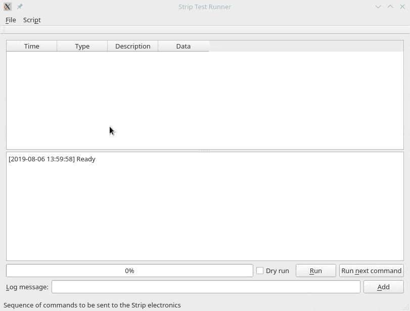

# StripTEASE - Strip TEst Analysis for System Evaluation

[](https://striptease.readthedocs.io/en/latest/?badge=latest)

This repository contains the code used to perform tests and anlyze results for
the STRIP system level tests. It uses Python 3.6.x and Qt 5.

## Installation

You have two choices to install this program:

1. Install and use it as any other Python package; good if you are not
   a Python expert but just want to control the Strip instrument;

2. Install it with the aim to develop and improve it; good if you know
   some Python and do not want to prevent yourself from patching the
   code.
   
If you want to follow the first route, use the following commands (possibly after having [created a virtual environment](https://docs.python.org/3/library/venv.html)):

```bash
git clone git@github.com:lspestrip/striptease.git
cd striptease
python setup.py install
```

If you are a developer, use these commands:

```bash
git clone git@github.com:lspestrip/striptease.git
cd striptease
python -m pip install -e .
```

Striptease includes a C++ program used to send long sequence of
commands to the Strip electronics. This program is written in C++ and
requires a separate compilation step:

```bash
cd TestRunner
qmake TestRunner.pro && make
```

## How to use the code

Once you have configured the library using the
[documentation](https://striptease.readthedocs.io/en/latest/authentication.html),
you can happily use IPython or a Jupyter notebook to write your code.
Start with the following command:

```python
from striptease import Connection
c = Connection()
c.login()
```

## Running long scripts

Programs like `program_turnon.py` generate JSON files that can be fed
either to `program_batch_runner.py` or TestRunner`. To generate a JSON
file that turns on all the polarimeters in board `G`, run the
following from the command line:

```bash
python program_turnon.py -o turnon.json G
```

Now you can either use a command-line utility or the GUI program
`TestRunner` to run it. In the first case, run the following command:

```bash
./program_batch_runner.py turnon.json
```

While the program is running, you can use the following keys:

- `SPACE` or `p` pauses the execution (press any key to resume);
- `l` enters a log message;
- `q` prompt the users if it is necessary to quit the script.

If you prefer to use the GUI, start `TestRunner/TestRunner` and load
file `turnon.json`, then press the `Run` command to start the
execution.



## Description of the available programs

### Turn-on procedure

To produce a JSON file that contains the turn-on procedure for one or
more radiometers, run

```bash
./program_turnon.py [args] POLARIMETER [POLARIMETER...]
```

Use the switch `--help` to get a full list of the available
parameters. The procedure is written to the terminal, so you surely
want to save it in a file; either use the syntax `> JSON_FILE` or the
`-o` flag to do this.

The specification for `POLARIMETER` can be one of the following:

- A module name, like `G` or `R`: in this case, all the polarimeters
  belonging to that module will be turned on in sequence.
  
- A horn name, like `G0` or `Y3`: in this case, the polarimeter that
  should be connected to the horn will be turned on. (The nominal
  correspondence between horns and polarimeters is provided in file
  `data/default_warm_biases.xlsx`.)
  
- A string like `G0:STRIP33`: in this case, the default association
  between horns and polarimeters can be overridden. This can be useful
  when running debugging tests on the hardware.
  
