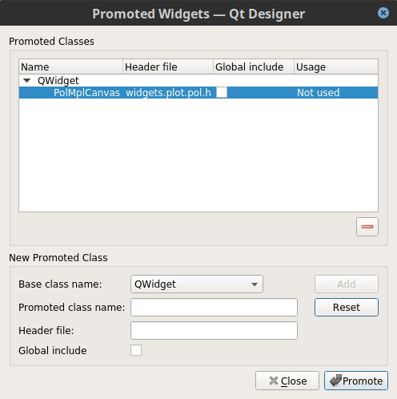
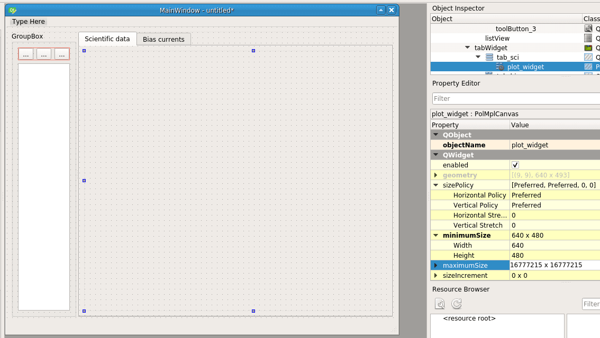

Developer's manual
==================

This section of the documentation describes how to develop new
features.

Graphical User Interfaces (GUIs)
--------------------------------

In this section, we provide a few recipes that show how to implement
features commonly found in GUI programs.

Creating new forms
~~~~~~~~~~~~~~~~~~

A *form* is a window on the screen containing controls, called
*widgets*. Striptease uses the `PyQt
<https://www.riverbankcomputing.com/software/pyqt/intro>`_ bindings to
the `Qt library <https://www.qt.io/>`_ to show and manipulate forms.

As the visual layout of forms can be extremely complex, Qt provides a
GUI tool to design and test forms, called `Qt Designer
<https://doc.qt.io/qt-5/qtdesigner-manual.html>`_. Although Qt
Designer has been developed with C++ programmers in mind, it can be
used to create forms to be used in Python programs too.

Here is a screenshot of Qt Designer:

.. figure:: _static/qtdesigner.png
            :align: center
            :alt: Qt Designer 5.9 screenshot

            QT Designer 5.9

Using Websocket plots in forms
~~~~~~~~~~~~~~~~~~~~~~~~~~~~~~

A common feature in Striptease programs is to show a real-time plot of
the data read from the electronic boards. Striptease provides a class,
:class:`widgets.plot.pol.PolMplCanvas`, that helps in implementing
this kind of widget. Here we provide an explanation of how to use it
in forms designed with Qt Designer.

Once you have created a new form in Qt Designer, insert a plain
**Widget** control in the form. This form is generic, i.e., it will be
shown as a transparent rectangular surface: Qt Designer has no way to
understand how it will appear once the program is completed.

We must however tell Qt Designer that this widget should be of the
proper type. This is called *promotion*: select the new transparent
widget and pick the entry «Promote to…» from the contextual menu under
the object inspector, as shown in the following figure.

.. figure:: _static/polmplcanvas-01-promote.png
            :align: center
            :alt: Contextual menu to promote a widget in Qt Designer

A new window will appear. This window contains all the custom widgets
defined so far in Qt Designer, and it should be empty. Fill the fields
with the following values:

* **Base class name**: leave as it is now (``QWidget``);
* **Promoted class name**: enter ``PolMplCanvas`` (case is important!);
* **Header file**: enter ``widgets.plot.pol.h``;
* **Global include**: leave it blank.

The header file we have specified is ``widgets.plot.pol.h``, which is
simply the Python module containing the definition for
``PolMplCanvas``, with a ``.h`` appended at the end. The ``.h``
extension must be inserted because Qt Designer always thinks that
modules are defined in C++ header files; this extension will be
silently dropped once we load the form in our Python script.

.. figure:: _static/polmplcanvas-02-promoted-widget-1.png
            :align: center
            :alt: Specifying how to promote a widget to ``PolMplCanvas`` (1/2)

Once you have entered the values listed above, press *Add*; the new
promotion should be added to the list *Promoted classes*:

So far we have defined a promotion from a generic widget to a
:class:`widgets.plot.pol.PolMplCanvas`, but we have not asked Qt
Designer to use it on our widget in the main form (see the text «Not
used» under the column *Usage*?). Just press the button *Promote* to
promote the widget.

We need only one final touch. From the point of view of Qt Designer,
the widget is no longer a generic ``QWidget``, but yet the program
does not know how to plot it. This means that the widget has no size,
and thus the scaling of the form might look weird when opened in Qt
Designer. To fix this, you can set the field *minimumSize* in the
Property Editor on the left. Setting it to 640×480 is usually fine:

