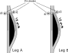

Polarimeters
============

This section explains some general-purpose functions and constants
that are useful to manipulate polarimeters.

Boards
------

If you need to iterate over all the board names, or if you want to
check if the board name provided as input by the user is valid, you
can use :data:`.STRIP_BOARD_NAMES`. The following example mocks a
processing script that needs to iterate over all the boards but one;
it shows how ``STRIP_BOARD_NAME`` can make the code more elegant::

  from striptease import STRIP_BOARD_NAMES

  while True:
      board_to_skip = input("Enter the board to skip: ")
      if board_to_skip in STRIP_BOARD_NAMES:
          break
      else:
          print(f"'{board_to_skip}' is not a valid board, retry")

  for cur_board_name in STRIP_BOARD_NAMES:
      if cur_board_name == board_to_skip:
          continue

      print(f"Processing board {cur_board_name}")
      # …

The output of the code is the following, assuming that the user
entered ``R`` at the prompt:

.. code-block:: none

   Enter the board to skip: R
   Processing board V
   Processing board G
   Processing board B
   Processing board Y
   Processing board O
   Processing board I

Polarimeter names
-----------------

Switching between modules and polarimeters
~~~~~~~~~~~~~~~~~~~~~~~~~~~~~~~~~~~~~~~~~~

Each «module» (e.g., ``I0``) is associated with a «polarimeter»
(``STRIP34``), and it is often the case that procedures and data
analysis codes need to jump from one representation to another.

The association is stored in the file
``data/default_biases_warm.xlsx``, and it can be accessed using the
class :class:`.InstrumentBiases`::

  from striptease.biases import InstrumentBiases

  biases = InstrumentBiases()
  print(biases.module_name_to_polarimeter("W3"))
  # Output:
  # STRIP70

  print(biases.polarimeter_to_module_name("STRIP34"))
  # Output:
  # I0

W-band polarimeters
~~~~~~~~~~~~~~~~~~~

The convention used to name the Strip polarimeters is rather
unfortunate, as it follows a different convention for Q and W-band
polarimeters. While the former are indicated by a letter identifying
the *board* and a positive number indicating the polarimeter index in
the board, W-band polarimeters always use the letter ``W``, regardless
of the board.

The constant :data:`.BOARD_TO_W_BAND_POL` is a dictionary that
associates the uppercase letter of each board to the name of the
W-band polarimeter, or ``None`` in the case of board ``I``::

  from striptease import STRIP_BOARD_NAMES, BOARD_TO_W_BAND_POL

  for cur_board in STRIP_BOARD_NAMES:
      w_pol = BOARD_TO_W_BAND_POL[cur_board]

      if w_pol:
          print(f"{w_pol} is connected to board {cur_board}")
      else:
          print(f"Board {cur_board} has no W-band polarimeters")

The output of the script is the following:

.. code-block:: none

   W3 is connected to board R
   W4 is connected to board V
   W6 is connected to board G
   W5 is connected to board B
   W1 is connected to board Y
   W2 is connected to board O
   Board I has no W-band polarimeters

In some contexts, a saner naming convention is used for W-band
polarimeters: they are referred using the name of the board they
belong to, followed by the index ``7``. For instance, the name ``R7``
can be used to refer to polarimeter ``W3``, as this polarimeter is
connected to board ``R``. The function
:func:`.normalize_polarimeter_name` can be used to turn the name ``W3``
into the R-based name::

  print(normalize_polarimeter_name("W1")) # Prints Y7

Polarimeter index within a board
~~~~~~~~~~~~~~~~~~~~~~~~~~~~~~~~

The function :func:`.get_polarimeter_index` returns a zero-based index
of a polarimeter in a board, given the name of the polarimeter. W-band
polarimeters always use index ``7``:

.. code-block:: none

  print(get_polarimeter_index("R0")) # Print 0
  print(get_polarimeter_index("G4")) # Print 4
  print(get_polarimeter_index("W1")) # Print 7

Iterating over polarimeters
~~~~~~~~~~~~~~~~~~~~~~~~~~~

It is often the case that some code needs to iterate over all the
polarimeters in a board. The function :func:`.polarimeter_iterator`
can be used in ``for`` loops to efficiently scan the list of
polarimeters for a board::

  for board_name, pol_idx, pol_name in polarimeter_iterator():
      print(f"Board '{board_name}': polarimeter '{pol_name}' (#{pol_idx})")

This is the output:

.. code-block:: none

  Board 'R': polarimeter 'R0' (#0)
  Board 'R': polarimeter 'R1' (#1)
  Board 'R': polarimeter 'R2' (#2)
  Board 'R': polarimeter 'R3' (#3)
  Board 'R': polarimeter 'R4' (#4)
  Board 'R': polarimeter 'R5' (#5)
  Board 'R': polarimeter 'R6' (#6)
  Board 'R': polarimeter 'W3' (#7)
  Board 'V': polarimeter 'V0' (#0)
  Board 'V': polarimeter 'V1' (#1)
  Board 'V': polarimeter 'V2' (#2)
  Board 'V': polarimeter 'V3' (#3)
  Board 'V': polarimeter 'V4' (#4)
  Board 'V': polarimeter 'V5' (#5)
  Board 'V': polarimeter 'V6' (#6)
  Board 'V': polarimeter 'W4' (#7)
  Board 'G': polarimeter 'G0' (#0)
  Board 'G': polarimeter 'G1' (#1)
  Board 'G': polarimeter 'G2' (#2)
  Board 'G': polarimeter 'G3' (#3)
  Board 'G': polarimeter 'G4' (#4)
  Board 'G': polarimeter 'G5' (#5)
  Board 'G': polarimeter 'G6' (#6)
  Board 'G': polarimeter 'W6' (#7)
  Board 'B': polarimeter 'B0' (#0)
  Board 'B': polarimeter 'B1' (#1)
  Board 'B': polarimeter 'B2' (#2)
  Board 'B': polarimeter 'B3' (#3)
  Board 'B': polarimeter 'B4' (#4)
  Board 'B': polarimeter 'B5' (#5)
  Board 'B': polarimeter 'B6' (#6)
  Board 'B': polarimeter 'W5' (#7)
  Board 'Y': polarimeter 'Y0' (#0)
  Board 'Y': polarimeter 'Y1' (#1)
  Board 'Y': polarimeter 'Y2' (#2)
  Board 'Y': polarimeter 'Y3' (#3)
  Board 'Y': polarimeter 'Y4' (#4)
  Board 'Y': polarimeter 'Y5' (#5)
  Board 'Y': polarimeter 'Y6' (#6)
  Board 'Y': polarimeter 'W1' (#7)
  Board 'O': polarimeter 'O0' (#0)
  Board 'O': polarimeter 'O1' (#1)
  Board 'O': polarimeter 'O2' (#2)
  Board 'O': polarimeter 'O3' (#3)
  Board 'O': polarimeter 'O4' (#4)
  Board 'O': polarimeter 'O5' (#5)
  Board 'O': polarimeter 'O6' (#6)
  Board 'O': polarimeter 'W2' (#7)
  Board 'I': polarimeter 'I0' (#0)
  Board 'I': polarimeter 'I1' (#1)
  Board 'I': polarimeter 'I2' (#2)
  Board 'I': polarimeter 'I3' (#3)
  Board 'I': polarimeter 'I4' (#4)
  Board 'I': polarimeter 'I5' (#5)
  Board 'I': polarimeter 'I6' (#6)

Valid keywords for :func:`.polarimeter_iterator` are `boards` and
`include_q_band`/`include_w_band`, which permit to pick which boards
to scan and to include/exclude Q and W-band polarimeters::

  for _, pol_idx, pol_name in polarimeter_iterator(boards=["V"], include_w_band=False):
      print(f"Polarimeter {pol_name} (#{pol_idx})")

In this case, the output is the following:

.. code-block:: none

  Polarimeter V0 (#0)
  Polarimeter V1 (#1)
  Polarimeter V2 (#2)
  Polarimeter V3 (#3)
  Polarimeter V4 (#4)
  Polarimeter V5 (#5)
  Polarimeter V6 (#6)

You can see that the W-band polarimeter of board ``V`` (``W4``) was
not included.

Amplifiers
----------

Indexing
~~~~~~~~

The official naming convention enumerates the amplifiers according to
the line exiting the phase switch (``A`` or ``B``) and their order
within the line (``1``, ``2``, ``3``). Therefore, amplifier ``HA1`` is
the first stage of amplification in line ``A``, and it's followed by
``HA2``, which is in turn followed by ``HA3`` (the last amplification
stage).

However, there have been two other ways to enumerate the LNAs in a
QUIET/Strip polarimeter:

1. The indexes used by JPL for the QUIET experiment (e.g., ``Q5``);
2. The indexes used when designing the electronic boards (e.g.,
   ``H4``).

The web server used to operate Strip in Bologna and in Tenerife uses
the indexes understood by the **electronic board**, which neglects the
official naming convention. The function :func:`.get_lna_num` computes
the zero-based index of an LNA from its full name in one of the three
conventions named above::

  # All these examples refer to the same LNA
  print(get_lna_num("HA3"))  # Print 4
  print(get_lna_num("H4"))   # Print 4
  print(get_lna_num("Q5"))   # Print 4

Modes of operation
~~~~~~~~~~~~~~~~~~

A Strip amplifier can operate either in *open loop* or *closed loop*
mode, depending on how the gate and drain are set:

1. In *open loop mode*, the drain voltage :math:`V_d` and gate voltage
   :math:`V_g` are set by the user, while the drain current
   :math:`I_d` is set free to adapt to the voltages.

2. In *closed loop mode*, the drain current :math:`I_d` and drain
   voltage :math:`V_d` are set by the user, and a retro-feedback
   circuit in the electronics adapts the gate voltage :math:`V_g` to
   make sure that the drain current :math:`I_d` is kept at the level
   specified by the user.

The following figure depicts the difference between the two modes,
representing the three bias parameters :math:`I_d`, :math:`V_d`, and
:math:`V_g` as knobs; only green knobs can be manipulated by the user,
while the blue knob responds automatically to variations in the green
knobs.

.. figure:: _static/open-closed-loop-mode.svg
            :align: center
            :alt: Open/closed loop modes

The way an amplifier operates can be set using the ``POL_MODE``
command, through the method :meth:`.StripConnection.set_pol_mode`. You
can use the enumeration class :class:`.PolMode` to specify the flags
to be used, but usually you can stick to the two constants
:data:`.OPEN_LOOP_MODE` and :data:`.CLOSED_LOOP_MODE`::

        import striptease as st

        conn = st.StripConnection()
        conn.set_pol_mode("I0", OPEN_LOOP_MODE)

Phase switches
--------------

Each polarimeter in Strip implements two phase switches, which are
devices able to inject a phase shift in the signal by making it pass
through a longer path to induce a phase shift in the wave. They are
called «switches» because they are usually employed to turn this shift
on and off at some fixed rate (from several Hz up to kHz).

Each phase switch in the Strip polarimeters can either switch at 4 kHz
(fast switching) or at 50 Hz (slow switching). It implements two
paths, whose length in terms of the wavelength λ differs by λ/2, so
that it effectively induces a 180° phase shift whenever the signal
goes through the longer path. Each path can be activated or
deactivated by controlling a «pin diode»: if the diode is
forward-biased, it lets the radiation pass through its path, but if it
is reverse-biased, radiation is blocked. Thus, to make a phase switch
induce an alternating phase shift of 0°/180°, it must switch back and
forth between a «forward/reverse» and a «reverse/forward»
configuration, so that the signal can either pass through the first or
the second path, but never through both of them (which would cause
destructive interference when the two paths join).

The default configuration of the phase switches is the following:

- The first phase switch (leg A) oscillates at 4 kHz;
- The second phase switch (leg B) oscillates at 50 Hz.

There is no need to send sequences of commands to make each pin diode
switch regularly as time passes, as the electronics is smart enough to
understand how to do so. You can either tell the electronics to switch
or to stay fixed at some position.

The values to be sent to the pin diodes are listed in the enumeration
class :class:`.PhswPinMode`; they can be sent to the diodes using the
method :meth:`.StripConnection.set_phsw_status`. Of particular interest
is the constant ``NOMINAL_SWITCHING``, which assumes a different
meaning depending on the pin diode you are programming: it makes sure
that the default configuration for each of the four pins is set, i.e.,
switching at 4 kHz for leg A and at 50 Hz for leg B.

Here is an example where we set the state of the four pin diodes for
polarimeter ``I0`` to the nominal state::

  conn = StripConnection()
  for pin_idx in range(4):
      conn.set_phsw_status(
          polarimeter="I0",
          phsw_index=pin_idx,
          status=PhswPinMode.NOMINAL_SWITCHING,
      )

More complex configurations can of course be employed; the following
example makes the signal pass through the shorter path while blocking
the longer one::

  conn = StripConnection()
  conn.set_phsw_status("I0", 0, PhswPinMode.STILL_SIGNAL)
  conn.set_phsw_status("I0", 1, PhswPinMode.NO_SIGNAL)
  conn.set_phsw_status("I0", 2, PhswPinMode.STILL_SIGNAL)
  conn.set_phsw_status("I0", 3, PhswPinMode.NO_SIGNAL)

