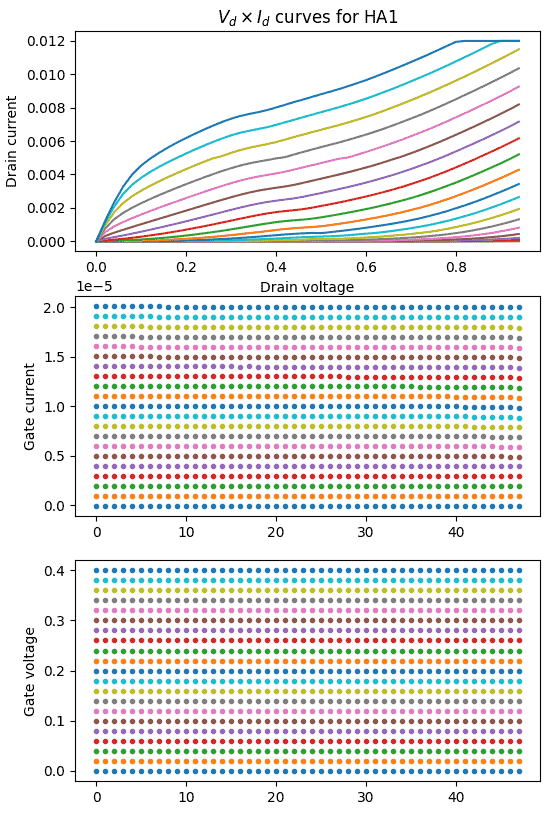
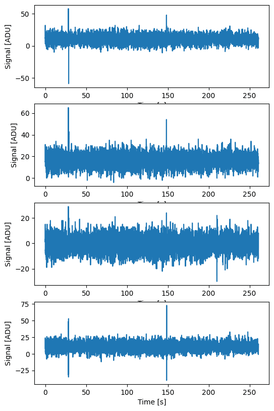

Accessing unit test data
========================

Striptease implements a few functions to download and access the data
acquired during the unit tests of the Strip polarimeters. These tests
were done at the cryogenic laboratory of the University of Milan
Bicocca, and they are used as reference in some of the system-level
tests. The tests are currently available at
https://striptest.fisica.unimi.it/unittests/; the library provides a
simple interface to download the data from there and load them into
Python objects.

Here is an example that shows how to use these functionalities::

  import striptease.unittests as u

  # Download the test with ID #354 from the web server. This might
  # take a few seconds…
  test = u.get_unit_test(354)

  # …but if you ask for it again, it will use a local cache and will
  # return the value instantly
  _ = u.get_unit_test(354)

  # The result of the call to "u.get_unit_test" is a UnitTest object
  print(type(test))
  # Output:
  # <class 'striptease.unittests.UnitTest'>

  print(f"{test.url}, {test.polarimeter_name}")
  # Output:
  # https://striptest.fisica.unimi.it/unittests/tests/354, STRIP02

  # The "test" variable only contains metadata about the test.
  # To actually load the datasets, use "u.load_unit_test_data".
  # It returns the actual data from the HDF5 file itself.
  data = u.load_unit_test_data(test)

  # The type of "data" depends on the test; it can either be a
  # "UnitTestDC" class or a "UnitTestTimestream" class.
  print(type(data))
  # Output:
  # <class 'striptease.unittests.UnitTestDC'>

The type of the return value of the function
:func:`.load_unit_test_data` depends on the kind of test. During the
unit tests in the cryogenic laboratory of the University of Milano
Bicocca, tests were grouped in two categories:

- DC tests exercised every single component of each polarimetric unit.
  They were done using an apparatus that provided biases and measured
  currents and voltages. Data acquired during this kind of test is
  stored in a :class:`.UnitTestDC` object.

- The tests that exercised the polarimeter as a whole used a different
  acquisition system, which was able to record the timing of each
  measurement. Data acquired during this kind of test is stored in a
  :class:`.UnitTestTimestream` object.

In the next chapters we detail the structure of the two classes
:class:`.UnitTestDC` and :class:`.UnitTestTimestream`.

Single-component tests
----------------------

Single-component tests, also known as «DC tests», are represented by
an instance of the class :class:`.UnitTestDC`. The class provides the
data measured while exercising each of the components in the
``components`` field, which is an instance of the class
:class:`.UnitTestDCCurves`. You can think of both classes as wrappers
to ``dict`` types.

Here is an example, using test `#354
<https://striptest.fisica.unimi.it/unittests/tests/354>`_ as a
testbed::

  import striptease.unittests as u
  import matplotlib.pylab as plt

  data = u.load_unit_test_data(u.get_unit_test(354))
  ha1_ivdv_data = data.components['HA1'].curves['IDVD']

  _, axes = plt.subplots(nrows=3, figsize=(6, 14))
  axes[0].plot(
      ha1_ivdv_data['DrainV'],
      ha1_ivdv_data['DrainI'],
  )
  axes[0].set_title(r'$V_d \times I_d$ curves for HA1')
  axes[0].set_xlabel('Drain voltage')
  axes[0].set_ylabel('Drain current')

  axes[1].plot(ha1_ivdv_data['GateI'], '.')
  axes[1].set_ylabel('Gate current')

  axes[2].plot(ha1_ivdv_data['GateV'], '.')
  axes[2].set_ylabel('Gate voltage')

The result is the following plot:

            Plot generated by the example script

Note that in this test the drain current and voltage were measured
every time the gate biases were changed. The actual behavior of the
data depends of course on the component and the test being done.

Polarimetric tests (timelines)
------------------------------

Timeline data acquired during a Strip unit test is stored in objects
of type :class:`.UnitTestTimestream`. The following example shows how
to plot the demodulated data acquired during test `#355
<https://striptest.fisica.unimi.it/unittests/tests/355>`_ (STRIP02)::

  import striptease.unittests as u
  import matplotlib.pylab as plt

  data = u.load_unit_test_data(u.get_unit_test(355))
  _, axes = plt.subplots(nrows=4, figsize=(6, 17))

  # Plot the output of DEM0, DEM1, DEM2, and DEM3
  for i in range(4):
      axes[i].plot(data.time_s, data.demodulated[:, i])
      axes[i].set_xlabel("Time [s]")
      axes[i].set_ylabel("Signal [ADU]")

And here is the result:

            Plot generated by the example script

How caching works
-----------------

Every time the function :func:`.get_unit_test` is called, it saves a
copy of the HDF5 file and the metadata downloaded from the unit test
webserver into a hidden directory within the home folder of the
current user. The metadata are saved in a SQLite3 database, and the
HDF5 file is saved within the same folder.

The path to the SQLite3 database can be accessed using the constant
``DEFAULT_UNIT_TEST_CACHE_PATH``. However, you will probably never
need to mess with this directory, as it is handled internally by the
library.

Module contents
----------------------------------

.. automodule:: striptease.unittests
    :members:
    :undoc-members:
    :show-inheritance:

